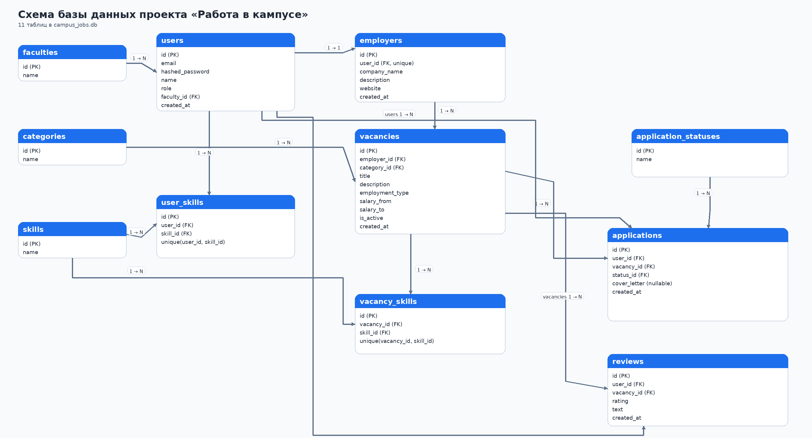

# Платформа поиска работы в кампусе

Учебный проект — сайт для поиска студенческих вакансий. Студенты могут просматривать вакансии и откликаться на них, работодатели — размещать вакансии и управлять заявками.

## Технологии

- FastAPI + SQLAlchemy + SQLite
- Bootstrap 5
- pytest + httpx

## Установка и запуск

```bash
python -m venv .venv
source .venv/bin/activate  # Windows: .venv\Scripts\activate
pip install -r requirements.txt
uvicorn app.main:app --reload
```

Открыть в браузере: http://localhost:8000

## Тесты

```bash
pytest -v
```

## Структура проекта

```
├── app/           # FastAPI приложение
│   ├── main.py
│   ├── models.py
│   ├── schemas.py
│   └── routes/    # auth, vacancies, applications, catalog
├── tests/         # pytest тесты
├── static/        # HTML + CSS + JS
└── docs/          # ER-диаграмма
```

## ER-диаграмма


